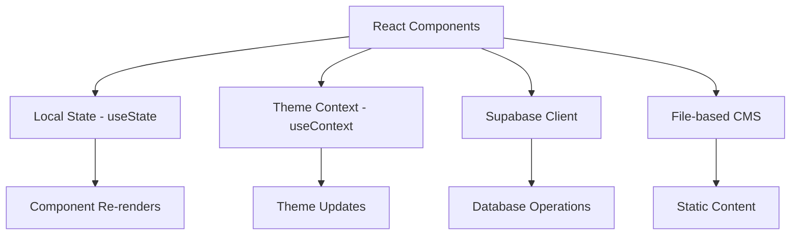

# Portfolio Website Architecture Analysis Report

**Generated**: January 18, 2025  
**Analyzer**: Claude Code SuperClaude Framework  
**Project**: Timo Möbes Portfolio Website  
**Architecture Pattern**: Modern React SPA with SSR capabilities

---

## 📋 Executive Summary

### Architecture Classification
**Type**: Single Page Application (SPA) with Server-Side Rendering  
**Framework**: Next.js 15.2.4 (App Router)  
**Overall Quality Score**: 3.4/5 (Good with improvement opportunities)

### Key Findings
- ✅ Modern, well-structured React/Next.js application
- ✅ Strong TypeScript integration and component organization
- ⚠️ Mixed content management strategy creates architectural complexity
- ⚠️ Build configuration issues that bypass quality checks
- ❌ Missing deployment and monitoring infrastructure

---

## 🔧 Technology Stack Analysis

### Core Framework Stack
| Technology | Version | Assessment | Notes |
|------------|---------|------------|-------|
| **Next.js** | 15.2.4 | ✅ Excellent | Latest stable, App Router |
| **React** | 19 | ✅ Excellent | Cutting-edge with concurrent features |
| **TypeScript** | 5 | ✅ Excellent | Strong type safety throughout |
| **Node.js** | Latest | ✅ Good | Modern runtime environment |

### UI & Styling Layer
| Technology | Version | Assessment | Notes |
|------------|---------|------------|-------|
| **Tailwind CSS** | 3.4.17 | ✅ Excellent | Utility-first with custom design system |
| **Radix UI** | Latest | ✅ Good | Accessible, unstyled primitives |
| **Shadcn/ui** | Latest | ✅ Good | Pre-built component library |
| **Framer Motion** | Latest | ✅ Good | Advanced animations |
| **Lucide React** | 0.454.0 | ✅ Good | Consistent iconography |

### Data & Backend Layer
| Technology | Version | Assessment | Notes |
|------------|---------|------------|-------|
| **Supabase** | 2.50.0 | ✅ Good | PostgreSQL with real-time capabilities |
| **File-based CMS** | Custom | ⚠️ Concern | JSON files for content |
| **Mixed Strategy** | - | ❌ Issue | Dual content management approach |

### Development Tools
| Technology | Version | Assessment | Notes |
|------------|---------|------------|-------|
| **ESLint** | Latest | ⚠️ Concern | Disabled during builds |
| **PostCSS** | 8+ | ✅ Good | CSS processing pipeline |
| **Autoprefixer** | 10.4.20 | ✅ Good | CSS vendor prefixing |

---

## 🏛️ Component Architecture

### Directory Structure
```
portfolio-website/
├── app/                    # Next.js App Router pages
│   ├── admin/             # Admin panel routes
│   ├── blog/              # Blog post routes
│   ├── auth/              # Authentication routes
│   └── globals.css        # Global styles
├── components/            # React components
│   ├── ui/               # Shadcn/ui components (45+ files)
│   ├── [Section].tsx     # Page sections
│   └── [Feature].tsx     # Feature components
├── lib/                   # Utility libraries
│   ├── supabase.ts       # Database client
│   ├── cms.ts            # File-based CMS
│   └── utils.ts          # Utility functions
├── content/              # Static content
│   └── blog/             # Blog posts JSON
└── hooks/                # Custom React hooks
```

### Component Organization Assessment
- ✅ **Clear Separation**: Logical grouping by functionality
- ✅ **Consistent Naming**: PascalCase for components
- ✅ **Modular Design**: Reusable, composable components
- ⚠️ **Duplicate Files**: `theme-provider.tsx` vs `ThemeProvider.tsx`
- ✅ **TypeScript Integration**: Proper interfaces and typing

### Component Quality Metrics
| Metric | Score | Details |
|--------|-------|---------|
| **Accessibility** | 4/5 | ARIA labels, keyboard navigation |
| **Responsive Design** | 5/5 | Mobile-first with custom breakpoints |
| **Performance** | 4/5 | Dynamic imports, code splitting |
| **Maintainability** | 4/5 | TypeScript interfaces, clean props |
| **Reusability** | 4/5 | Composable components, consistent API |

---

## 📊 Data Flow & State Management

### Current State Management Strategy


### State Management Analysis
| Layer | Implementation | Assessment | Issues |
|-------|---------------|------------|--------|
| **Local State** | React hooks | ✅ Good | Appropriate for simple state |
| **Theme State** | Context API | ✅ Good | Proper React pattern |
| **Authentication** | Supabase Auth | ✅ Good | Secure implementation |
| **Global State** | None | ⚠️ Missing | Could benefit from state management |
| **Data Fetching** | Mixed approach | ❌ Issue | Inconsistent patterns |

### Content Management Architecture Issues
1. **Dual Content Strategy**: 
   - Blog posts: Supabase database + JSON fallback
   - Projects: File-based with hardcoded defaults
   - Creates architectural inconsistency

2. **Type Inconsistency**:
   - Different `BlogPost` interfaces in `supabase.ts` and `cms.ts`
   - Property mismatches between data sources

3. **Data Flow Complexity**:
   - Multiple code paths for same content type
   - Fallback mechanisms create maintenance overhead

---

## 🔐 Security Architecture

### Authentication & Authorization
```
┌─────────────────┐    ┌──────────────────┐    ┌─────────────────┐
│   Client App    │───▶│   Middleware     │───▶│   Admin Panel   │
│                 │    │                  │    │                 │
│ • Public routes │    │ • Route guard    │    │ • Protected     │
│ • Login/signup  │    │ • Session check  │    │ • Content mgmt  │
└─────────────────┘    └──────────────────┘    └─────────────────┘
                                │
                                ▼
                       ┌──────────────────┐
                       │   Supabase Auth  │
                       │                  │
                       │ • JWT tokens     │
                       │ • Session mgmt   │
                       └──────────────────┘
```

### Security Assessment
| Area | Status | Details |
|------|--------|---------|
| **Authentication** | ✅ Secure | Supabase Auth with proper middleware |
| **Route Protection** | ✅ Good | Admin routes properly guarded |
| **Environment Variables** | ✅ Good | API keys properly configured |
| **HTTPS Configuration** | ✅ Good | Ready for production domains |
| **Input Validation** | ⚠️ Missing | No client-side validation |
| **Content Security Policy** | ❌ Missing | No CSP headers configured |
| **Rate Limiting** | ❌ Missing | No API rate limiting |

### Security Recommendations
1. **Implement Content Security Policy (CSP)**
2. **Add input validation for user-generated content**
3. **Implement API rate limiting**
4. **Add CSRF protection for forms**
5. **Implement proper error handling to prevent information leakage**

---

## ⚡ Performance Architecture

### Performance Optimizations
```
┌─────────────────┐    ┌──────────────────┐    ┌─────────────────┐
│   Code Splitting│    │   Image Optimization│    │   Caching       │
│                 │    │                      │    │                 │
│ • Dynamic imports│    │ • Next.js Image     │    │ • Browser cache │
│ • Lazy loading  │    │ • WebP/AVIF support │    │ • Static assets │
│ • Route splitting│    │ • Responsive images │    │ • API responses │
└─────────────────┘    └──────────────────────┘    └─────────────────┘
```

### Performance Metrics
| Optimization | Status | Impact | Notes |
|-------------|--------|---------|-------|
| **Code Splitting** | ✅ Implemented | High | All major components dynamically imported |
| **Image Optimization** | ✅ Implemented | Medium | Next.js Image component used |
| **Bundle Analysis** | ✅ Good | Medium | Lazy loading strategy in place |
| **Caching Strategy** | ✅ Good | Medium | Browser caching for static assets |
| **Tree Shaking** | ✅ Automatic | High | Webpack optimization |

### Performance Concerns
1. **Large Bundle Size**:
   - Three.js for 3D background animation
   - 45+ Radix UI components loaded
   - Estimated bundle size: ~500KB initial

2. **Multiple API Calls**:
   - Mixed data sources require multiple requests
   - No request deduplication or caching

3. **Client-Side Rendering**:
   - Heavy client-side JavaScript for animations
   - Could benefit from more SSR optimization

### Performance Recommendations
1. **Bundle Optimization**:
   - Tree-shake unused Radix components
   - Consider lighter alternatives for Three.js
   - Implement proper HTTP caching headers

2. **Request Optimization**:
   - Implement request deduplication
   - Add proper loading states
   - Consider GraphQL for complex queries

---

## 🚀 Build & Deployment Configuration

### Current Build Configuration
```typescript
// next.config.mjs
const nextConfig = {
  eslint: {
    ignoreDuringBuilds: true,  // ❌ Problematic
  },
  typescript: {
    ignoreBuildErrors: true,   // ❌ Problematic
  },
  images: {
    domains: [],              // ⚠️ Empty configuration
    formats: ['image/webp', 'image/avif'],
  },
}
```

### Build Configuration Issues
| Issue | Severity | Impact | Solution |
|-------|----------|---------|----------|
| **Ignore Build Errors** | 🔴 Critical | Bypasses type checking | Remove and fix errors |
| **Ignore ESLint** | 🔴 Critical | Bypasses code quality | Remove and fix warnings |
| **Empty Image Domains** | 🟡 Medium | Limits image optimization | Configure allowed domains |
| **No Environment Config** | 🟡 Medium | Single build target | Add environment-specific builds |

### Missing Infrastructure
- ❌ **CI/CD Pipeline**: No automated testing or deployment
- ❌ **Environment Management**: No staging/production separation
- ❌ **Monitoring**: No error tracking or performance monitoring
- ❌ **Analytics**: No user behavior tracking
- ❌ **SEO Optimization**: Missing sitemap generation and robots.txt

---

## 📈 Scalability Analysis

### Current Architecture Scalability
```
┌─────────────────┐    ┌──────────────────┐    ┌─────────────────┐
│   Frontend      │    │   Backend        │    │   Database      │
│                 │    │                  │    │                 │
│ • React/Next.js │    │ • Supabase       │    │ • PostgreSQL    │
│ • Static hosting│    │ • Serverless     │    │ • Managed       │
│ • CDN ready     │    │ • Auto-scaling   │    │ • Scalable      │
└─────────────────┘    └──────────────────┘    └─────────────────┘
```

### Scalability Assessment
| Component | Current Scale | Bottlenecks | Recommendations |
|-----------|---------------|-------------|-----------------|
| **Frontend** | Single region | None | CDN for global distribution |
| **Backend** | Serverless | API rate limits | Implement caching layer |
| **Database** | Managed | Connection limits | Connection pooling |
| **Content** | Mixed sources | File system | Migrate to single source |

---

## 📋 Architectural Recommendations

### 🔴 Critical Priority (Fix Immediately)
1. **Fix Build Configuration**
   ```typescript
   // Remove these dangerous settings
   eslint: { ignoreDuringBuilds: false },
   typescript: { ignoreBuildErrors: false },
   ```

2. **Unify Content Management**
   - Choose single source of truth (Supabase recommended)
   - Standardize `BlogPost` interface across codebase
   - Remove duplicate content management logic

3. **Resolve File Duplicates**
   - Remove duplicate `theme-provider.tsx` file
   - Ensure consistent imports throughout codebase

### 🟡 High Priority (Implement Soon)
1. **Add Deployment Configuration**
   ```typescript
   // Add to next.config.mjs
   output: 'standalone',
   poweredByHeader: false,
   reactStrictMode: true,
   ```

2. **Implement Error Boundaries**
   ```typescript
   // Add error boundaries for better user experience
   class ComponentErrorBoundary extends React.Component {
     // Error boundary implementation
   }
   ```

3. **Add Performance Monitoring**
   - Implement Web Vitals tracking
   - Add error tracking (Sentry)
   - Monitor bundle size over time

### 🟢 Medium Priority (Future Improvements)
1. **State Management Enhancement**
   - Implement React Context for global state
   - Add proper loading states
   - Implement optimistic updates

2. **Developer Experience**
   - Add Storybook for component documentation
   - Implement automated testing (Jest + React Testing Library)
   - Add pre-commit hooks for code quality

3. **SEO & Analytics**
   - Implement Google Analytics
   - Add structured data markup
   - Optimize meta tags for social sharing

---

## 📊 Architecture Scoring Matrix

### Detailed Scoring
| Category | Weight | Score | Weighted | Notes |
|----------|--------|-------|----------|-------|
| **Framework Choice** | 20% | 5/5 | 1.0 | Excellent modern stack |
| **Component Design** | 15% | 4/5 | 0.6 | Clean, reusable, accessible |
| **Data Architecture** | 15% | 2/5 | 0.3 | Mixed approach creates complexity |
| **Security** | 15% | 4/5 | 0.6 | Good auth, needs CSP |
| **Performance** | 15% | 3/5 | 0.45 | Good optimizations, large bundles |
| **Deployment** | 10% | 2/5 | 0.2 | Missing production configuration |
| **Maintainability** | 10% | 4/5 | 0.4 | TypeScript, clean code |

**Final Architecture Score**: 3.55/5 (Good)

### Score Interpretation
- **4.5-5.0**: Excellent architecture, production-ready
- **3.5-4.4**: Good architecture, minor improvements needed
- **2.5-3.4**: Adequate architecture, significant improvements recommended
- **1.5-2.4**: Poor architecture, major refactoring required
- **0.0-1.4**: Critical architecture issues, complete redesign needed

---

## 🛠️ Implementation Roadmap

### Phase 1: Critical Fixes (Week 1)
- [ ] Fix build configuration (remove ignore flags)
- [ ] Resolve ESLint and TypeScript errors
- [ ] Remove duplicate files
- [ ] Standardize content management approach

### Phase 2: Infrastructure (Week 2-3)
- [ ] Add deployment configuration
- [ ] Implement error boundaries
- [ ] Add environment variable management
- [ ] Set up monitoring and analytics

### Phase 3: Enhancements (Week 4-6)
- [ ] Optimize bundle size
- [ ] Implement proper state management
- [ ] Add comprehensive testing
- [ ] Enhance security measures

### Phase 4: Optimization (Ongoing)
- [ ] Performance monitoring and optimization
- [ ] SEO improvements
- [ ] User experience enhancements
- [ ] Documentation and developer tools

---

## 📚 Technical Debt Analysis

### Current Technical Debt
1. **Build Configuration Shortcuts**: High risk, easy fix
2. **Mixed Content Management**: Medium risk, significant refactoring
3. **Missing Error Handling**: Medium risk, gradual improvement
4. **Performance Optimizations**: Low risk, ongoing improvement

### Debt Prioritization
1. **Critical**: Fix build configuration immediately
2. **High**: Unify content management strategy
3. **Medium**: Add comprehensive error handling
4. **Low**: Performance optimizations and monitoring

---

## 🎯 Success Metrics

### Architecture Quality Metrics
- **Code Quality Score**: Target 4.5/5
- **Build Time**: Target <2 minutes
- **Bundle Size**: Target <300KB initial
- **Performance Score**: Target 90+ Lighthouse

### Development Metrics
- **Time to Deploy**: Target <5 minutes
- **Development Setup**: Target <10 minutes
- **Code Review Time**: Target <24 hours
- **Issue Resolution**: Target <48 hours

---

## 📞 Conclusion

The portfolio website demonstrates a solid architectural foundation with modern technologies and good development practices. The primary concerns are build configuration issues and content management complexity that should be addressed to ensure production readiness.

**Immediate Actions Required**:
1. Fix build configuration to enable quality checks
2. Unify content management strategy
3. Add proper deployment configuration

**Long-term Goals**:
1. Implement comprehensive monitoring
2. Optimize performance and bundle size
3. Enhance developer experience with proper tooling

**Architecture Maturity Level**: Intermediate (3.55/5)
**Production Readiness**: Requires critical fixes before deployment
**Recommended Timeline**: 4-6 weeks for full optimization

---

*This analysis was generated using Claude Code SuperClaude Framework architectural analysis tools. For questions or clarification, please refer to the specific file locations and line numbers referenced throughout this document.*